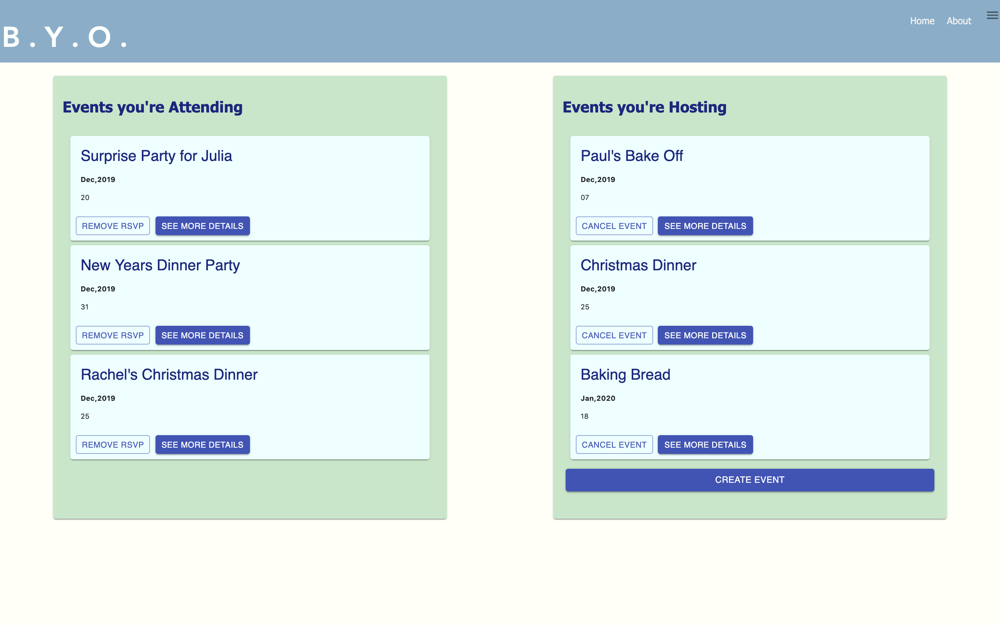
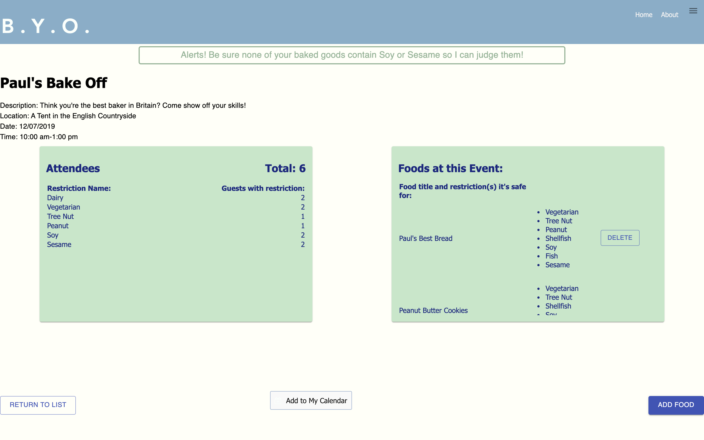

# B.Y.O.


## Description
Duration: 2 Week Project

B.Y.O. is a web application for event planning that is designed to easily track and communicate the allergies or dietary restrictions of the attendees to the host and other guests. This also gives guests who have restrictions an idea of whether foods that accommodate their needs will be present. Foods can be added to events by guests or event hosts, and they walk through a form to flag their foods as safe or unsafe for various restrictions. This means other guests won't be left wondering if the salad at an event will actually have bacon, making it unsuitable as a vegetarian option. Instead a vegetarian guest can quickly see if they need to bring their own dish to the event or plan to eat beforehand.

### Deployed Link 
Coming Soon!

## Screen Shots
### User's Home Page


### Event Details Page


## Prerequisites

- [Node.js](https://nodejs.org/en/)
- [PostrgeSQL](https://www.postgresql.org/)
- [Nodemon](https://nodemon.io/)


## Development Setup Instructions

### Create database and tables

Create a new database called `BYO` and commands for creating the necessary tables can be found in the database.sql file.

### Set up your local server
* Clone this respository 
* Run `npm install`
* Create a `.env` file at the root of the project and paste this line into the file:
    ```
    SERVER_SESSION_SECRET=superDuperSecret
    ```
    While you're in your new `.env` file, take the time to replace `superDuperSecret` with some long random string like `25POUbVtx6RKVNWszd9ERB9Bb6` to keep your application secure. Here's a site that can help you: [https://passwordsgenerator.net/](https://passwordsgenerator.net/). If you don't do this step, create a secret with less than eight characters, or leave it as `superDuperSecret`, you will get a warning.
* Start postgres if not running already by using `brew services start postgresql`
* Run `npm run server`
* Run `npm run client`
* Navigate to `localhost:3000`

## Usage
1. User creates their account with a username, email, and password
2. The user can now navigate to Edit Profile to set up their dietary needs. They can come back to this at any point if they're diagnosed with a new allergy or decide to go vegetarian.
3. The user's home page will display the list of upcoming events they've RSVP'd to, events they're hosting, or any events they've been invited to.
    - From this screen the user can dig deeper into a particular event's details. 
    - They can cancel their RSVP for an event they can no longer attend.
    - Events they're hosting can be canceled, deleting the event for all other guests. 
4. Going to the Event Detail page the user is presented with the current data about who is attending, what allergies or restrictions (and counts of the guests with these concerns), as well as the foods people are bringing and what restrictions for which they've been marked as safe.
    - On this screen a user can also quickly add the event to a google or apple calendar so they've got a reminder about the event outside of this application.
    - Additionally the user may open the add food form where they can title their dish, add a list of ingredients, and then they are prompted through a series of questions to help them categorize  their food as containing or free-from a particular ingredient. They're given some help text to bring awareness to ingredients they might not consider checking for. 
        - If at any point the user needs to take another look at the attendee breakdown they can simply click out of the dialog to take another look, but they will start at the beginning of the form while their answers have still been saved. 
        - On the confirmation page however the user can completely cancel a food that they don't wish to add or decide to confirm the information adding this food to the event foods list.
        - Since this user added the particular food they'll be able to Delete the food item if they need to change or update it later, but foods other user's are bringing don't have the option to be deleted.
5. After a user has taken a look through their Event's details they feel more comfortable about eating at this event because they know if there are safe options available to them. 


## Built With

- javascript 
- React
- Redux
- Sagas
- Moment.js
- react-add-to-calendar
- react-multi-email
- Material UI
- Node using express, body-parser, and pg
- PostgreSQL


## Roadmap
Due to the tight timeline to scope, architect, and implement the initial build of this application there were many features that I have not been able to incorporate yet. The next versions of this app will tackle some of the following:

- An Update Event page so that hosts may go in and modify the current event settings and invite additional guests.
- Allowing user-entered restrictions so that users may include more unusual allergies or dietary needs in their profile for example Pineapple or Avocado allergies which are uncommon. 
- Integrate SendGrid for email capabilities to notify users of events they've been invited to.
- Add a messaging system for attendees to privately message the event host about concerns they have. 
- Allow a user to manage profiles for multiple guests for example a plus-one or children.
- Have additional information collected about the user to personalize their profile. 
- Have additional settings for hosts to restrict who is able to bring food or share event hosting responsibilities with another user. 
- Use machine learning to guess which dietary restrictions most likely need to be managed for a given food. For example a user bringing cookies probably doesn't need to be asked if there is meat in their recipe.
- Include a display of the ingredients data for the food to the event detail page.
- Have loval public events that are able to advertise on the site that users can join without an invitation. 


## Acknowledgement
Thanks to Prime Digital Academy, the entire Scytale cohort, as well as the developers of the react-add-to-calendar and react-multi-email components. 
